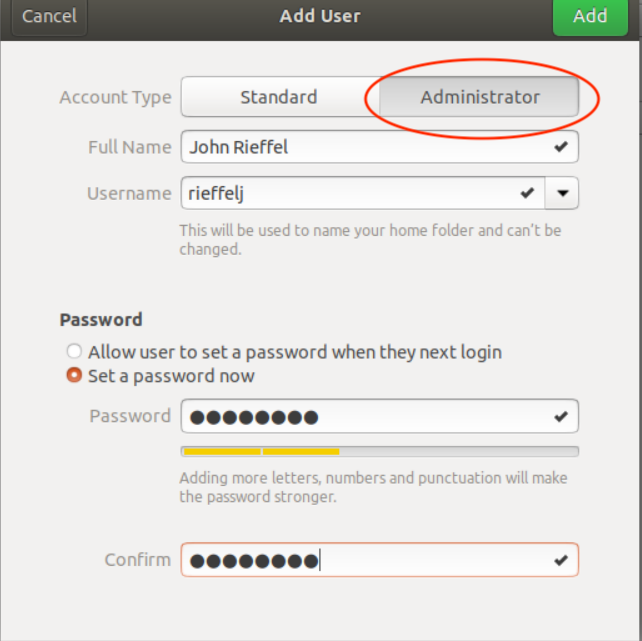

# 
Instructions on Setting up the Ubuntu Virtial Machine

I've created a VirtualBox VM that has much of the software that you'll need to 
take this classs remotely.  It has git, ssh, MPI and OpenMP installed, as well 
as Microsoft Visual Studio Code.

* Start by installing [Virtualbox](https://www.virtualbox.org/)
* Then Download the (3GB) CSC333 VM from Google Drive [here](https://drive.google.com/file/d/1npqedxeLg2TlsAeLmLFlFSTR5zEeM3Tc/view?usp=sharing)
* Launch VirtualBos and use `File->Import Appliance` to install the VM

You should now be able to launch and run the VM!

---
## Logging in and creating an account

The default username is `admin`, and the default password is `csc333!`.  The first 
thing you'll need to do is create an administrative user account for yourself.

Open up the settings app (you can click on the app launcher on the bottom left of the screen)

And you may need to click on the magnifying glass icon in the settings to find the pane for Users.

Open up the Users pane is the Settings App, unlock it, and click "Add User".

* be sure to click on Administrator
* make your username the same as your @union.edu username
* pick a password that is unique and secure

Then acccounts to your newly created account, and log in!

